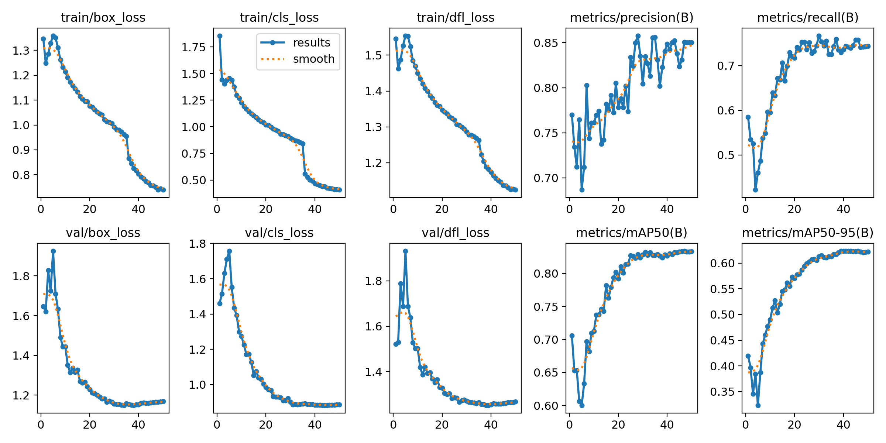
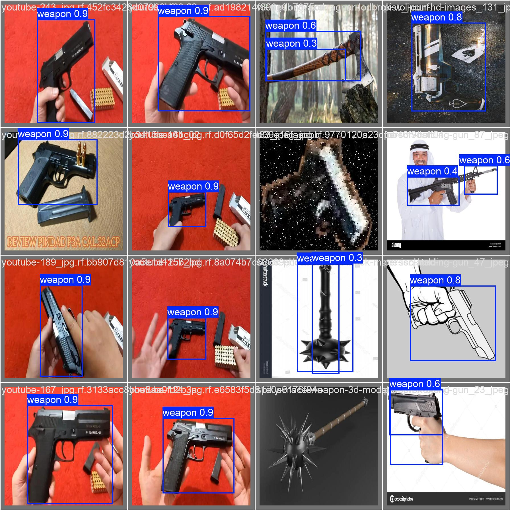
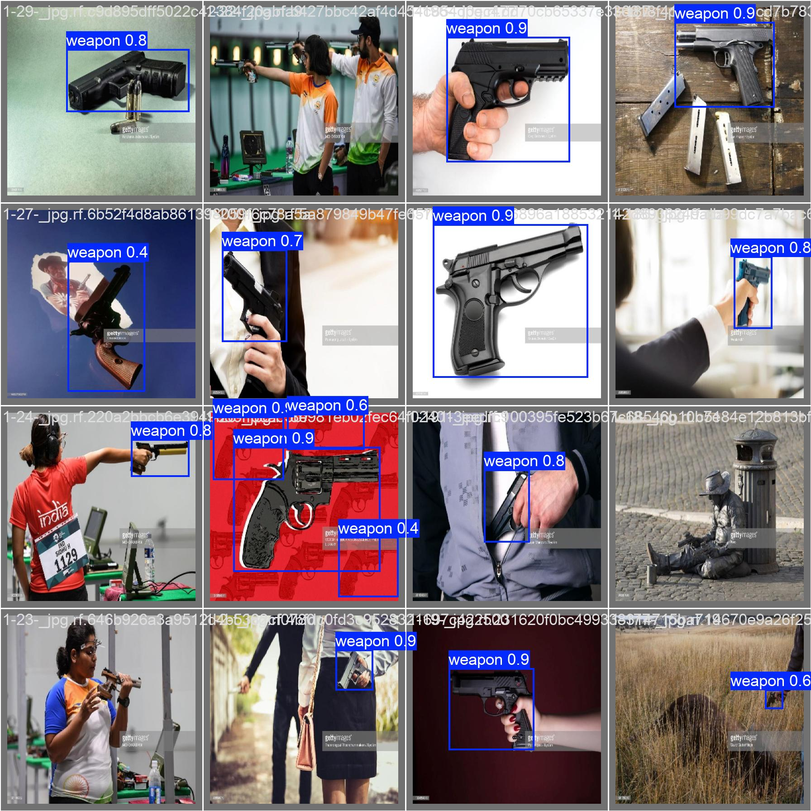

# Weapon Detection Project

This project trains a YOLOv8 small (`yolov8s`) model to detect weapons, prioritizing high precision. 

## 📊 Dataset Details

The dataset targets a single unified class for weapons.

**Data Splits:**
- **Train**: ~19,970 images
- **Validation**: ~1,023 images

**Target Classes:**
- **Weapon** (Class Index 0)

---

## ⚙️ Hyperparameter Configuration

The configuration is tuned to push the model's **Precision above 0.80** by tightening bounding box rules and minimizing false positives.

**Core Settings:**
- **Model:** `yolov8s.pt` (Small size - strong accuracy on ~20k images)
- **Epochs:** 50
- **Image Size:** 416
- **Batch Size:** 16 (Safe for 8GB VRAM)

**Loss & Optimization (Precision Focused):**
- **Initial Learning Rate (`lr0`):** `0.01`
- **Box Loss Gain (`box`):** `7.5`
- **Class Loss Gain (`cls`):** `0.5`
- **Label Smoothing:** `0.05`

**NMS & Regularization:**
- **Confidence Threshold (`conf`):** `0.30`
- **IoU Threshold (`iou`):** `0.65`

---

## 📈 Performance Metrics Guide

Understanding the metrics printed during training and evaluation:

**Training Losses (Lower is better)**
*   **`box_loss`**: How accurate the bounding boxes are drawn around the objects.
*   **`cls_loss`**: How accurate the model is at guessing the correct object strictly.
*   **`dfl_loss`**: How precise the model is with the fine pixel edges/boundaries of the box.

**Validation Metrics (Higher is better)**
*   **`Precision`**: When the model yells "Gun!", how often is it actually a gun? (Minimizes false alarms).
*   **`Recall`**: Out of all the real guns in the picture, how many did the model find? (Minimizes missed detections).
*   **`mAP50`**: Mean Average Precision at 50% overlap. Assesses general detection success.
*   **`mAP50-95`**: The strictest and most important metric. Averages precision across 50% to 95% bounding box overlaps. Ensures the model not only finds the object but draws a perfectly tight box around it.

---

## 🚀 Results

### Final Validation Metrics (Epoch 50)
- **Precision**: 0.850
- **Recall**: 0.744
- **mAP50**: 0.833
- **mAP50-95**: 0.622

### Training Curves

### Validation Predictions

---

## 📝 Dataset Citation

This project uses the following datasets from [Roboflow Universe](https://universe.roboflow.com):

1. **Weapon Detection v1** — 5-class dataset (Grenade, Knife, Missile, Pistol, Rifle)
   - **Workspace:** test-7awfy
   - **License:** CC BY 4.0
   - **URL:** [universe.roboflow.com/test-7awfy/weapon-detection-f1lih/dataset/1](https://universe.roboflow.com/test-7awfy/weapon-detection-f1lih/dataset/1)

2. **Weapon Detection v2** — 1-class dataset (Weapon)
   - **Workspace:** atmai
   - **License:** Public Domain
   - **URL:** [universe.roboflow.com/atmai/weapon-detection-j5ehm/dataset/2](https://universe.roboflow.com/atmai/weapon-detection-j5ehm/dataset/2)
